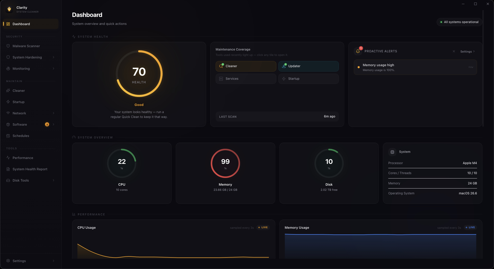

<p align="center">
  <a href="https://github.com/CaptainHacX/Clarity"></a>
</p>

<h1 align="center">Clarity</h1>

<p align="center">
  <b>Free, open-source system cleaner & security scanner for Windows, macOS, and Linux.</b><br/>
  Reclaim disk space. Remove malware. Take back your privacy. All in one app.
</p>

<p align="center">
  <!--
    Badges are static until the GitHub repository (CaptainHacX/Clarity) is made
    public. Once it is, restore the dynamic shields.io badges below: 
    Stars:     <a href="https://github.com/CaptainHacX/Clarity/stargazers"></a>
    Release:   <a href="https://github.com/CaptainHacX/Clarity/releases"></a>
    Downloads: <a href="https://github.com/CaptainHacX/Clarity/releases"></a>
    License:   <a href="LICENSE"></a>
    Build:     <a href="https://github.com/CaptainHacX/Clarity/actions"></a>
  -->
  
  
  
  <a href="LICENSE"></a>
  
  
</p>

<p align="center">
  <a href="https://github.com/CaptainHacX/Clarity/releases"><b>Download</b></a> &nbsp;&middot;&nbsp;
  <a href="https://github.com/CaptainHacX/Clarity"><b>GitHub</b></a> &nbsp;&middot;&nbsp;
  <a href="https://github.com/CaptainHacX/Clarity/issues"><b>Issues</b></a> &nbsp;&middot;&nbsp;
  <a href="CLI.md"><b>CLI Docs</b></a> &nbsp;&middot;&nbsp;
  <a href="https://github.com/CaptainHacX/Clarity/blob/main/rules/CATALOG.md"><b>Cleaner Catalog</b></a>
</p>

<p align="center">
  
</p>

---

## Table of Contents

- [Download](#download)
- [Why Clarity?](#why-clarity)
- [Features](#features)
- [Command-Line Interface](#command-line-interface)
- [Cleaner Rules](#cleaner-rules)
- [Tech Stack](#tech-stack)
- [Project Structure](#project-structure)
- [Development](#development)
- [Languages](#languages)
- [Contributing](#contributing)
- [Security](#security)
- [Disclaimer](#disclaimer)
- [License](#license)

---

## Download

Grab the latest installer for your platform from [GitHub Releases](https://github.com/CaptainHacX/Clarity/releases):

| Platform | Format | Direct download (v1.0.3) |
|----------|--------|--------------------------|
| **Windows** | `.exe` installer | [Clarity-Setup-1.0.3.exe](https://github.com/CaptainHacX/Clarity/releases/download/v1.0.3/Clarity-Setup-1.0.3.exe) |
| **macOS** | `.dmg` (Intel & Apple Silicon) | [Intel (x64)](https://github.com/CaptainHacX/Clarity/releases/download/v1.0.3/Clarity-1.0.3-prod-x64.dmg) &middot; [Apple Silicon (arm64)](https://github.com/CaptainHacX/Clarity/releases/download/v1.0.3/Clarity-1.0.3-prod-arm64.dmg) |
| **Linux** | `.AppImage` or `.deb` | [AppImage](https://github.com/CaptainHacX/Clarity/releases/download/v1.0.3/Clarity-1.0.3-prod-x86_64.AppImage) &middot; [deb](https://github.com/CaptainHacX/Clarity/releases/download/v1.0.3/Clarity-1.0.3-prod-amd64.deb) |

> **macOS note:** Clarity is **ad-hoc signed** but not notarized with an Apple Developer ID
> (that requires a paid Apple Developer account, which the project doesn't fund yet).
> Apple Silicon machines show **"Clarity" cannot be opened because the developer cannot
> be verified** on first launch. Fix it once:
>
> 1. Click **Cancel**, then open **System Settings → Privacy & Security**.
> 2. Scroll to the **Security** section and click **Open Anyway** next to Clarity.
> 3. Confirm in the dialog that appears. Clarity then launches normally.
>
> Terminal users can skip the prompt entirely:
>
> ```bash
> xattr -dr com.apple.quarantine "/Applications/Clarity.app"
> ```
>
> Windows releases are held until signing is configured (unsigned installers trigger
> SmartScreen, which we won't ship). Signing is **free** via SignPath Foundation — see
> [WINDOWS_SIGNING.md](WINDOWS_SIGNING.md). Once set up, the installer you download is
> signed and SmartScreen-clean.

## Why Clarity?

Most system cleaners are closed-source, ad-filled, and want your money — some are barely disguised malware themselves.

Clarity is **100% free, open-source, and transparent**. No ads, no upsells, no telemetry. You can read every line of code, audit every scan, and verify every delete.

- **Free & open source** — MIT licensed, no paid tiers, no dark patterns.
- **Privacy-first** — runs entirely on your machine; nothing is ever uploaded.
- **Auditable** — cleaning targets are plain JSON files anyone can review.
- **Cross-platform** — Windows, macOS, and Linux with identical cleaning coverage.
- **30 languages** — fully localized, with a scriptable CLI for power users.

## Features

### Clean & Reclaim Space

| Feature | What it does |
|---------|--------------|
| **System Cleaner** | Temp files, logs, caches, crash dumps |
| **Browser Cleaner** | Caches across Chrome, Edge, Firefox, Safari, and more |
| **App Cleaner** | Leftover cache data from 100+ apps |
| **Gaming Cleaner** | Game launcher & GPU shader caches (Steam, Epic, EA, etc.) |
| **Recycle Bin** | Empty Windows Recycle Bin |
| **Registry Cleaner** | Broken and orphaned registry entries |
| **Disk Analyzer** | Interactive treemap of disk usage |
| **Duplicate Finder** | Find and remove duplicate files |
| **Large File Finder** | Hunt down space-hogging files |
| **Empty Folder Cleaner** | Sweep up empty directories |
| **Disk Maintenance & Repair** | Maintain and repair drive health |
| **Debloater** | Remove Windows bloatware |
| **Driver Manager** | Identify and remove stale drivers |
| **Program Uninstaller** | Uninstall apps and clean up leftovers |

### Secure & Protect

| Feature | What it does |
|---------|--------------|
| **Malware Scanner** | Signature matching, heuristic analysis, Defender integration |
| **CVE Scanner** | Flag installed software with known vulnerabilities |
| **Threat Monitor** | Real-time monitoring for suspicious activity |
| **Privacy Shield** | Control 30+ Windows privacy settings (telemetry, ad ID, Cortana, tracking) |
| **Secure Delete** | Overwrite files with random data before deletion |
| **Firewall Audit** | Review and harden your firewall rules |
| **System Hardening** | Apply recommended security configurations |
| **Network Security** | Inspect open ports and network posture |
| **Wi-Fi Inspector** | See nearby networks, BSSIDs, and security details |
| **Device Audit** | Map devices on your network |

### Optimize & Control

| Feature | What it does |
|---------|--------------|
| **Startup Manager** | Boot impact analysis and startup control |
| **Service Manager** | Optimize Windows services |
| **Software Updater** | Bulk-update across winget, Chocolatey, Scoop & npm |
| **Game Mode** | Tune the system for gaming |
| **Port Manager** | View and manage listening ports |

### Monitor & Automate

| Feature | What it does |
|---------|--------------|
| **Performance Monitor** | Real-time CPU, memory, disk, network, per-core stats, S.M.A.R.T. |
| **System Health Report** | One-shot health overview of your machine |
| **System Restore Points** | Create restore points before cleaning |
| **Scheduled Scans** | Daily, weekly, or monthly automation |
| **Cleaning History** | Track past sessions & space recovered |
| **One-Click Clean** | Scan & clean everything in one click |
| **Context Menu Cleaner** | Clean directly from the right-click menu |
| **[CLI Mode](CLI.md)** | Scriptable, no GUI required |

## Command-Line Interface

Clarity works fully headless for scripting, IT administration, and scheduled tasks:

```bash
clarity --cli --all --clean --json    # scan + clean everything, machine-readable output
clarity --cli --system --browser      # scan specific categories only (dry run)
clarity --cli metrics                 # export Prometheus metrics
clarity --cli metrics-server          # serve metrics over HTTP (default :9100)
```

See [CLI.md](CLI.md) for the full reference — categories, options, JSON output schema, Prometheus metrics, and exit codes.

## Cleaner Rules

Clarity's cleaning targets are defined as **plain JSON files** — no code required to add a cleaner for your favorite app.

- **103 unique app rules** (Windows 91, macOS 77, Linux 75) covering apps, browsers, games, GPUs, and system paths.
- Validated against a [JSON Schema](rules/schema/rules.schema.json) with editor autocomplete.
- Template variables (`${APPDATA}`, `${CACHES}`, `${CONFIG}`, ...) resolve at runtime per-platform.

Browse what's covered in the [Cleaner Catalog](https://github.com/CaptainHacX/Clarity/blob/main/rules/CATALOG.md), and read the [Rules Contributing Guide](rules/RULES.md) to add your own:

```bash
npm run new-rule     # interactive generator — no manual JSON editing needed
npm run find-cache   # discover uncovered cache directories on your machine
npm run preview-rule # dry-run a rule before committing it
npm run validate:rules
```

## Tech Stack

| Layer | Technology |
|-------|------------|
| **Framework** | [Electron](https://www.electronjs.org/) 41 |
| **Build tool** | [electron-vite](https://electron-vite.org/) 5 + [Vite](https://vitejs.dev/) 7 |
| **Frontend** | [React](https://react.dev/) 19, [TypeScript](https://www.typescriptlang.org/) 5 |
| **Styling** | [Tailwind CSS](https://tailwindcss.com/) 4, [Framer Motion](https://www.framer.com/motion/) |
| **State** | [Zustand](https://zustand.docs.pmnd.rs/) |
| **Data & charts** | [better-sqlite3](https://github.com/WiseLibs/better-sqlite3), [Recharts](https://recharts.org/), [TanStack Table](https://tanstack.com/table) |
| **i18n** | [i18next](https://www.i18next.com/) — 30 locales |
| **Updater** | [electron-updater](https://www.electron.build/auto-update) |
| **System info** | [systeminformation](https://systeminformation.io/) |
| **Testing** | [Vitest](https://vitest.dev/) — 2,700+ tests |

## Project Structure

```
rules/             # Cleaner rule definitions (JSON) — add new cleaners here!
src/
├── main/          # Electron main process (CLI, services, IPC, rules engine)
├── preload/       # Preload scripts (bridge between main & renderer)
├── renderer/      # React frontend (pages, components, i18n locales)
└── shared/        # Shared types and utilities
docs/              # Additional documentation
choco/             # Chocolatey packaging
scripts/           # Dev tooling (new-rule, catalog, release, etc.)
```

## Development

**Prerequisites:** [Node.js](https://nodejs.org/) 20.19+ (or 22.12+) and npm.

```bash
# Install dependencies
npm install

# Run in development mode (hot reload)
npm run dev

# Type-check both processes
npm run typecheck

# Run the test suite (2,700+ tests)
npm test

# Production build
npm run build

# Package installers for the current OS (outputs to dist-prod/)
npm run package
```

CI runs type-checks, tests, rule validation, and builds on every PR, across Windows, macOS, and Linux. Releases are produced automatically when a `v*` tag is pushed (see [`.github/workflows/release.yml`](.github/workflows/release.yml)).

## Languages

Clarity is fully localized and available in **30 languages**: Arabic, Chinese (Simplified), Chinese (Traditional), Czech, Danish, Dutch, English, Finnish, French, German, Greek, Hebrew, Hindi, Hungarian, Indonesian, Italian, Japanese, Korean, Malay, Norwegian, Polish, Portuguese, Romanian, Russian, Spanish, Swedish, Thai, Turkish, Ukrainian, and Vietnamese.

## Contributing

Contributions are welcome — bug reports, feature requests, docs, and code.

- **Add a cleaner rule** with zero code: read the [Rules Guide](rules/RULES.md), then `npm run new-rule`.
- **Report bugs** using the [bug report template](https://github.com/CaptainHacX/Clarity/issues/new?template=bug_report.md).
- **Suggest features** using the [feature request template](https://github.com/CaptainHacX/Clarity/issues/new?template=feature_request.md).

See [CONTRIBUTING.md](CONTRIBUTING.md) for the full guide (conventions, structure, PR process). If you find Clarity useful, a star helps others discover the project.

## Security

Security is a priority — see [SECURITY.md](SECURITY.md) for our vulnerability reporting policy and supported-versions info.

## Disclaimer

Clarity by design removes files from your system. You are responsible for reviewing items before removal. We accept no liability for data loss or system instability. This software is provided "as is" without warranty.

## License

[MIT](LICENSE) &mdash; Copyright &copy; 2024-2026 Clarity Contributors.
